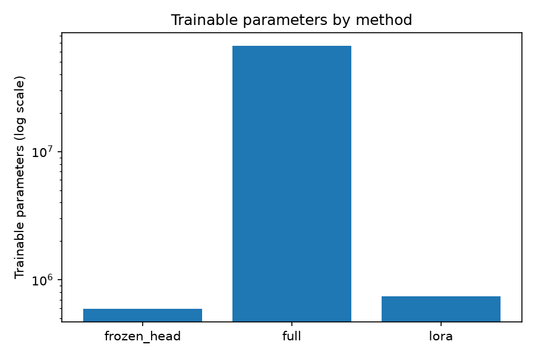
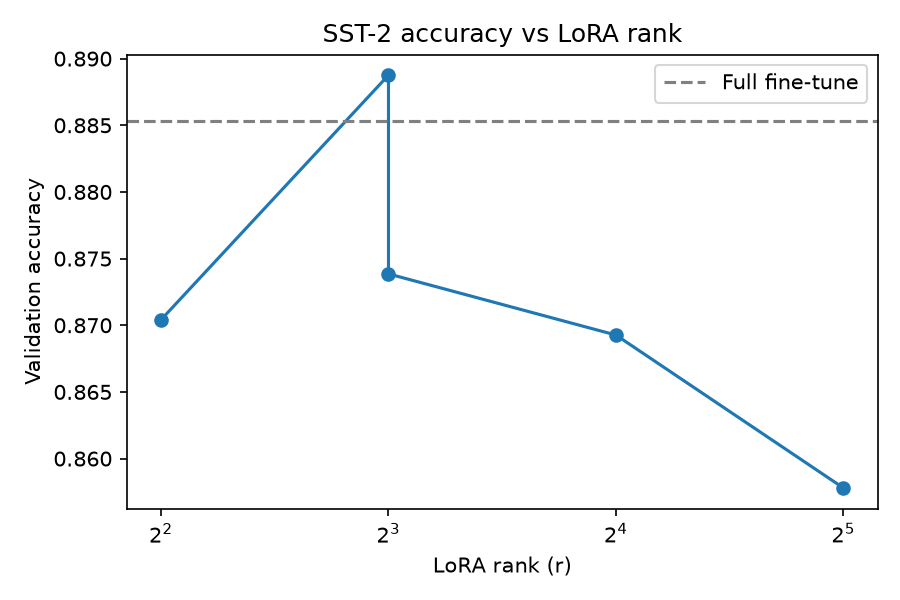
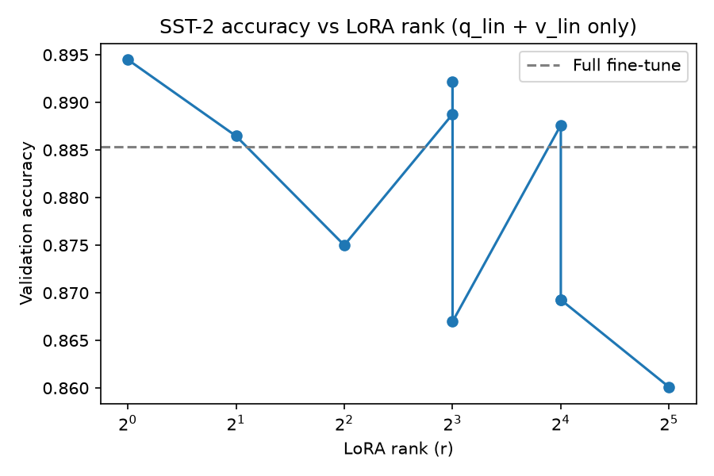

# LoRA From Scratch — DistilBERT on SST-2

A from-scratch reimplementation of [LoRA: Low-Rank Adaptation of Large Language Models](https://arxiv.org/abs/2106.09685) (Hu et al., 2021), tested on DistilBERT fine-tuned for sentiment classification on SST-2.

No `peft`, no external LoRA libraries the `LoRALinear` module, weight injection, and merge logic are all implemented here to actually understand the mechanism rather than call an API.

## Why this exists

Most "LoRA implementations" you'll find are five lines of `peft.LoraConfig()`. That's useful for getting work done, but it doesn't tell you anything about *why* LoRA works. This repo implements the low-rank decomposition, injects it into a real transformer's attention layers, trains it, and then verifies the paper's core claim directly: that merging the adapter back into the base weights produces numerically identical outputs with zero added inference cost.

Along the way it also reproduces two of the paper's ablations at a much smaller scale the rank sweep and the choice-of-target-matrices comparison to see whether the same trends hold up on a tiny model and a tiny GPU.

## What's actually implemented

- `LoRALinear`: wraps a frozen `nn.Linear`, adds a trainable low-rank update `BA` scaled by `alpha/r`, zero-initializes `B` so training starts identical to the base model
- `inject_lora()`: walks a HuggingFace model and swaps target `nn.Linear` layers with `LoRALinear` in place
- `merge_lora()`: folds the learned `BA` update into the base weight matrix and replaces `LoRALinear` with a plain `nn.Linear`, so post-merge inference has no extra matmuls at all
- A training harness shared across three configurations (full fine-tuning, frozen backbone + head only, LoRA) so the comparison is apples-to-apples
- A merge verification test that checks logits before and after merging are equal up to floating-point noise, and that the merged model is fully back to a `nn.Linear` (i.e. actual latency parity, not just weight parity)

## Results

Trained on SST-2, DistilBERT-base-uncased, 3 epochs, batch size 32.

| Method | Trainable params | % of total | Peak optimizer state | Val accuracy | Train time |
|---|---|---|---|---|---|
| Full fine-tune | 66,955,010 | 100% | 535.6 MB | 89.56% | 27.7 min |
| Frozen backbone + head | 592,130 | 0.88% | 4.7 MB | 81.31% | 11.2 min |
| LoRA (r=8, q+v) | 739,586 | 1.10% | 5.9 MB | **89.22%** | 20.6 min |

LoRA came within half a point of full fine-tuning accuracy while touching **90x fewer trainable parameters** and using **90x less optimizer state memory** (Adam's momentum + variance buffers scale directly with trainable param count, so this ratio isn't a coincidence it's the same 90x showing up twice). Frozen head trails both by a wide margin, which is really the point of this table: a linear head bolted onto frozen features doesn't have enough capacity to adapt to the new task, but a rank-8 update injected into attention does.



The scale on this chart is log, and it needs to be full fine-tuning's bar would make LoRA's and frozen-head's essentially invisible on a linear axis. That's the whole story of parameter-efficient fine-tuning in one image: two very different-looking small bars against one enormous one, with the small bars getting most of the accuracy anyway.

One honest note on these numbers: I reran the full three-way comparison multiple whie debugging the code and ironing out mistakes, and mulitple times the results moved, most notably once the full fine-tuning went from 88.53% to 89.56%, frozen head dropped from 83.49% to 81.31%, and this exact LoRA config moved from 88.88% to 89.22%. Same code, same data, same hyperparameters, different random seed. The table above uses the more recent run, but the swing itself is the more important finding see the rank sweep section below, where the same effect shows up even more clearly.

### Rank vs. accuracy

The first version of this plot mixed two things it shouldn't have the points weren't an isolated rank sweep, they were the target-matrix ablation below, plotted by rank, plus one extra point from the main comparison run:



That's why the original chart has two different accuracy values sitting at r=8: `q+v` at r=8 (from the main run) and `q+k+v+out` at r=8 (from the matrix ablation) are different configs that happen to share a rank, plotted as if they belonged on the same curve. I later reran the sweep properly — same `target_modules=(q_lin, v_lin)` held fixed, only `r` changing, run as one back-to-back batch (r ∈ {1, 2, 4, 8, 16, 32}):



Even with target matrices held constant, this doesn't show a clean saturation curve accuracy jumps around non-monotonically (r=1 is the single best point at 89.45%, r=32 the worst at 86.01%, with no clear trend in between). Before concluding anything about rank from the shape of this curve, look at what happened when I ran the *exact same config twice* in separate training runs:

| Config | Run 1 accuracy | Run 2 accuracy | Difference |
|---|---|---|---|
| r=8, q_lin+v_lin | 89.22% | 86.70% | 2.52 points |
| r=16, q_lin+v_lin | 88.76% | 86.93% | 1.83 points |

Same code, same hyperparameters, same data different random seed, and the accuracy moved more between these two runs than it does across most of the rank values in the sweep above. That's the actual headline finding here: on a task this small (SST-2, 872 validation examples) and with a single seed per configuration, seed variance is comparable to or larger than the effect being measured. The rank-vs-accuracy curve isn't necessarily wrong, but I can't currently tell the real trend apart from noise with only one run per point. Averaging 3-5 seeds per rank is the fix, and it's the first thing I'd add if I kept working on this.

### Which matrices matter

| Config | Rank | Trainable params | Val accuracy |
|---|---|---|---|
| q only | 32 | 887,042 | 85.78% |
| q + v | 16 | 887,042 | 86.93% |
| q + k + v + out | 8 | 887,042 | 87.39% |
| q + k + v + out + FFN | 4 | 923,906 | 87.04% |

Rank was scaled down as more matrices were added, to keep the trainable-parameter budget roughly constant across the first three rows (887k params exactly, since halving rank while doubling matrix count keeps the product constant). Going from q-only to q+k+v+out, accuracy rises monotonically as more matrices get a share of the same fixed budget consistent with the paper's finding that spreading a budget across more matrices at lower rank beats concentrating it on one matrix at higher rank.

Adding the FFN layers on top (last row) breaks the clean trend slightly accuracy dips a little versus q+k+v+out despite more matrices getting adapted. It's also worth flagging a separate inconsistency: in the headline comparison table above, `q+v` at r=8 hit 88.88%, but `q+k+v+out` at the same r=8 (in this table) only reached 87.39% , more matrices, same rank, *worse* accuracy. That's the opposite of what more capacity should do, and the honest read is that with a single seed and ~1-2 point gaps on a task this easy, some of this variation is just run-to-run noise rather than a real effect of matrix choice. I'd want to average over 3+ seeds before trusting any of these orderings as a real finding rather than variance.

### Merge verification

```
Max logit difference after merge: 5.42e-06
Merge verified: identical outputs, zero inference overhead confirmed.
Unmerged forward pass: 365.568 ms/iter
Merged forward pass:   352.758 ms/iter
Speedup: 1.04x
```

`5.42e-06` is small enough to be floating-point accumulation noise, not zero. That distinction matters: if `B` hadn't actually been trained (still near its zero-init value), this diff would come out as exactly `0.00e+00` regardless of whether the merge logic was correct  a trivially true pass that doesn't actually verify anything. Getting a small-but-nonzero number here, on a checkpoint that was genuinely trained, is what confirms the merge is folding a real, nontrivial `BA` update into the base weights and producing equivalent outputs not that there was nothing to fold in the first place.

The latency number is a modest 1.04x, not the dramatic speedup the "zero inference overhead" framing might suggest. That's expected, not a problem with the implementation: LoRA was only injected into two Linear layers (`q_lin`, `v_lin`) out of the many Linear layers in DistilBERT, so removing the adapter branch from just those two only removes a small fraction of the model's total compute per forward pass. The claim LoRA actually makes isn't "inference gets much faster", it's "inference doesn't get slower relative to the original model," and a merged model running at roughly base-model speed (rather than base-model-plus-adapter-overhead speed) is exactly what a 1.04x, not a fractional or negative, speedup demonstrates.

## Implementation notes

A few things that weren't obvious going in:

**Zero-initializing B, not A.** If both `A` and `B` are initialized randomly, the adapter starts by injecting noise into the base model's forward pass before any training has happened. Zero-initializing `B` means `BA = 0` at step zero regardless of `A`, so the model starts exactly at the pretrained checkpoint's behavior and the adapter only starts contributing once gradients actually flow.

**LoRA needs a much higher learning rate than full fine-tuning.** Full fine-tuning uses something like 2e-5 here; LoRA needed roughly two orders of magnitude higher to train in the same number of steps. This makes sense once you think about it, you're training a small number of randomly-initialized parameters from scratch, not nudging an already-converged full parameter set. Using the full-fine-tuning learning rate for LoRA made it look like it wasn't learning much of anything, which isn't a fair comparison.

**Merging is not just a weight update.** The first version of the merge function updated `self.base.weight` in place but left the module as a `LoRALinear`, whose `forward()` still added the (now redundant) LoRA branch on top. That double-counts the adapter's contribution merge needs to also swap the module back to a plain `nn.Linear` in the parent, not just mutate weights and leave the forward path untouched.

**Optimizer state, not just parameter count, is where LoRA's memory savings actually show up most cleanly.** Adam keeps two extra float32 buffers (momentum, variance) per trainable parameter, so optimizer state scales linearly with trainable params measured here as 535.6 MB for full fine-tuning versus 5.9 MB for LoRA, a 90x reduction, exactly matching the 90x reduction in trainable parameter count. Peak *total* GPU memory doesn't shrink by nearly as much (2180.7 MB → 1271.1 MB, about 1.7x), because activation memory for the forward/backward pass through every frozen layer doesn't go away just because those layers aren't being updated — LoRA still needs gradients to flow through them to reach the adapters. The parameter-count and memory-footprint stories are related but not the same story, which is easy to conflate if you only look at the "1% of parameters" headline number.

## Repo structure

```
.
├── lora.py            # LoRALinear, inject_lora, merge_lora, param counting utils
├── data.py            # SST-2 loading + tokenization
├── train.py           # shared training loop for full / frozen-head / LoRA
├── ablations.py        # rank sweep + target-module sweep
├── merge_verify.py     # numerical + latency equivalence check
├── plot_results.py     # generates the plots in results/plots/
└── results/
    ├── metrics.csv
    └── plots/
```

## Reproducing this

```bash
git clone <your-repo-url>
cd lora-from-scratch
python -m venv venv && source venv/bin/activate
pip install torch transformers datasets scikit-learn matplotlib pandas

# quick smoke test
python -c "from train import train; train('lora', epochs=1, subset_size=500)"

# full three-way comparison
python train.py

# rank + matrix ablations
python ablations.py

# merge correctness + latency check
python merge_verify.py

# plots
python plot_results.py
```

Tested on an NVIDIA Quadro P2000 (4GB VRAM, Pascal). Full training set + 3 epochs per config comfortably fits in memory; summing `train_time_s` across the ablation rows in `results/metrics.csv` gives roughly 90 minutes for the 5 LoRA configs run at `subset_size=20000` — figure closer to 2-3 hours if rerun on the full 67k training set instead.

## What I'd do differently next time

- **Single-seed variance is large enough to obscure the effects I was actually trying to measure.** This isn't a hedge — it's directly visible in the data: rerunning the identical `r=8, q+v` config in two separate training runs produced 89.22% and 86.70%, a 2.5-point swing from seed alone. Most of the differences I initially wanted to read as "effect of rank" or "effect of which matrices" are the same size or smaller than that. The fix is averaging 3-5 seeds per configuration before trusting any ordering between them as real rather than noise — I didn't have time to do that here, so I'm reporting single runs and flagging explicitly where I don't trust the resulting trend.
- Only tried r up to 32 on a 67M-parameter model. The original paper works with models orders of magnitude larger, where the rank-saturation point likely sits differently — this isn't evidence about where that point is at scale, just about where it lands on DistilBERT and SST-2 specifically.
- The merge-latency speedup (1.04x) is modest because LoRA was only applied to 2 of DistilBERT's many Linear layers. A version applying LoRA more broadly (attention + FFN, as in the matrix ablation) would likely show a larger relative speedup after merging, since more of the forward pass would have adapter overhead to remove.

## Reference

Hu, E. J., Shen, Y., Wallis, P., Allen-Zhu, Z., Li, Y., Wang, S., Wang, L., & Chen, W. (2021). *LoRA: Low-Rank Adaptation of Large Language Models.* [arXiv:2106.09685](https://arxiv.org/abs/2106.09685)
